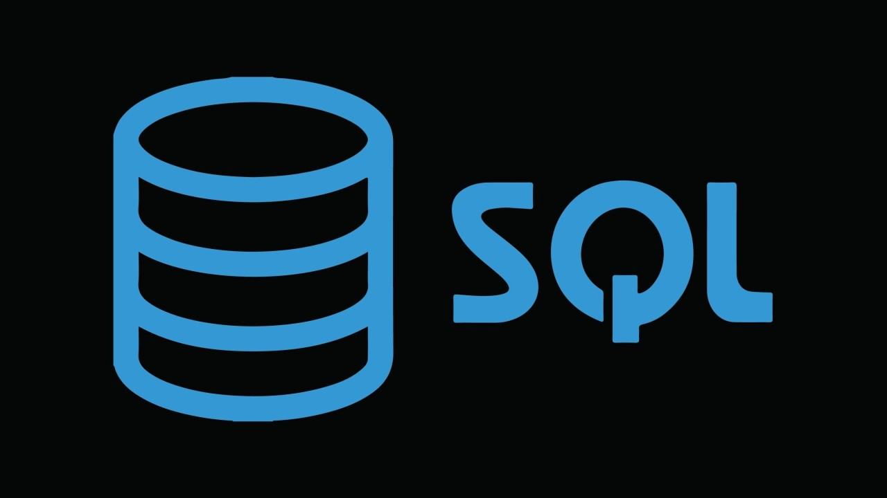
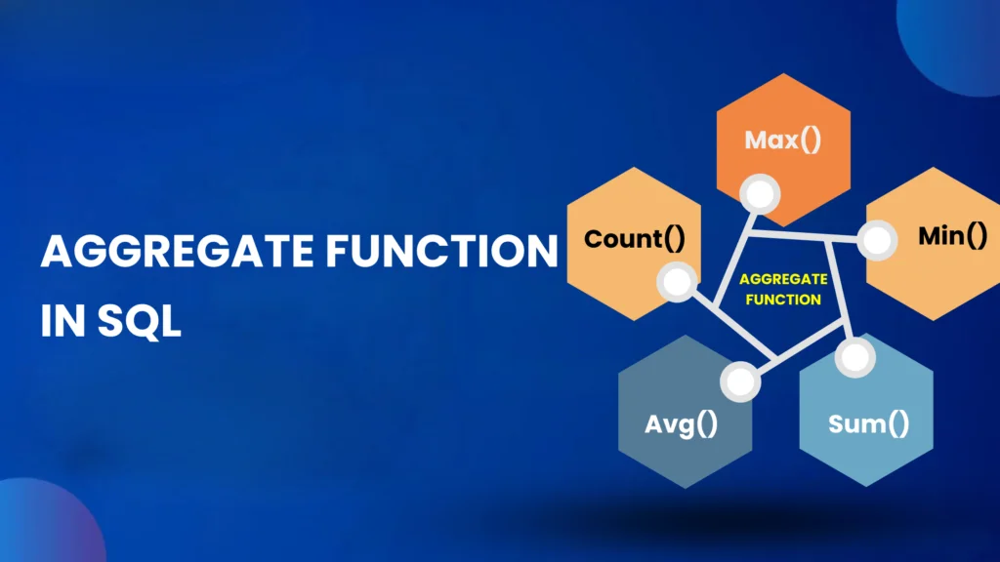

# SQL Report: Basics, Joins, and Aggregations

## 1. Introduction

Structured Query Language (SQL) is used to interact with relational databases. It allows you to store, retrieve, manipulate, and analyze data efficiently. SQL is widely used in backend development, data analytics, and database management systems like MySQL, PostgreSQL, and SQL Server.

---

## 2. SQL Basics

### 2.1 Creating a Database

```sql
CREATE DATABASE company_db;
```

### 2.2 Creating a Table

```sql
CREATE TABLE employees (
    id INT PRIMARY KEY,
    name VARCHAR(50),
    department VARCHAR(50),
    salary INT
);
```

### 2.3 Inserting Data

```sql
INSERT INTO employees (id, name, department, salary)
VALUES
(1, 'Alice', 'HR', 40000),
(2, 'Bob', 'IT', 60000),
(3, 'Charlie', 'Finance', 50000);
```

### 2.4 Selecting Data

```sql
SELECT * FROM employees;
```

### 2.5 Filtering Data

```sql
SELECT * FROM employees
WHERE salary > 45000;
```

### 2.6 Updating Data

```sql
UPDATE employees
SET salary = 65000
WHERE id = 2;
```

### 2.7 Deleting Data

```sql
DELETE FROM employees
WHERE id = 3;
```

---

### Learn SQL Basics

This video explains Creating Database, Creating Table,Inserting, Filtering,Updating data and Deleting data with examples:

[](https://www.youtube.com/watch?v=3s0lFtUrhSQ)

---

## 3. SQL Joins

Joins are used to combine data from multiple tables based on a related column.

### Sample Tables

**employees**

| id | name    | dept_id |
| -- | ------- | ------- |
| 1  | Alice   | 101     |
| 2  | Bob     | 102     |
| 3  | Charlie | 103     |

**departments**

| dept_id | dept_name |
| ------- | --------- |
| 101     | HR        |
| 102     | IT        |
| 104     | Sales     |

---

### 3.1 INNER JOIN

Returns matching records from both tables.

```sql
SELECT e.name, d.dept_name
FROM employees e
INNER JOIN departments d
ON e.dept_id = d.dept_id;
```

---

### 3.2 LEFT JOIN

Returns all records from the left table and matching records from the right table.

```sql
SELECT e.name, d.dept_name
FROM employees e
LEFT JOIN departments d
ON e.dept_id = d.dept_id;
```

---

### 3.3 RIGHT JOIN

Returns all records from the right table and matching records from the left table.

```sql
SELECT e.name, d.dept_name
FROM employees e
RIGHT JOIN departments d
ON e.dept_id = d.dept_id;
```

---

### 3.4 FULL JOIN

Returns all records when there is a match in either table.

```sql
SELECT e.name, d.dept_name
FROM employees e
FULL OUTER JOIN departments d
ON e.dept_id = d.dept_id;
```

---

### Learn SQL Joins (Video)

This video explains INNER, LEFT, RIGHT, and FULL JOIN with examples:

[](https://www.youtube.com/watch?v=wW4xcQ3FFp4)

---

## 4. SQL Aggregations

Aggregation functions perform calculations on multiple rows and return a single value.

### Sample Table: employees

| id | name  | department | salary |
| -- | ----- | ---------- | ------ |
| 1  | Alice | HR         | 40000  |
| 2  | Bob   | IT         | 60000  |
| 3  | John  | IT         | 50000  |

---

### 4.1 COUNT()

```sql
SELECT COUNT(*) AS total_employees
FROM employees;
```

---

### 4.2 SUM()

```sql
SELECT SUM(salary) AS total_salary
FROM employees;
```

---

### 4.3 AVG()

```sql
SELECT AVG(salary) AS avg_salary
FROM employees;
```

---

### 4.4 MAX() and MIN()

```sql
SELECT MAX(salary) AS highest_salary,
       MIN(salary) AS lowest_salary
FROM employees;
```

---

### 4.5 GROUP BY

Groups rows sharing a property.

```sql
SELECT department, AVG(salary) AS avg_salary
FROM employees
GROUP BY department;
```

---

### 4.6 HAVING

Filters grouped data.

```sql
SELECT department, COUNT(*) AS total
FROM employees
GROUP BY department
HAVING COUNT(*) > 1;
```

---

### Learn SQL Aggregations

This video explains  data with examples:

[](https://www.youtube.com/watch?v=wIljdjni_dc&t=5s)

---

## 5. Conclusion

SQL is a powerful tool for handling relational data.

* **Basics** help you perform CRUD operations.
* **Joins** allow combining multiple tables.
* **Aggregations** help analyze and summarize data.

Mastering these concepts is essential for roles in backend development, data analytics, and database management.

---

## 6. Practice Tips

* Practice writing queries daily.
* Work on real datasets.
* Solve interview questions on joins and aggregations.
* Focus on optimization using indexes and query planning.

---

